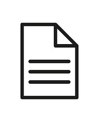
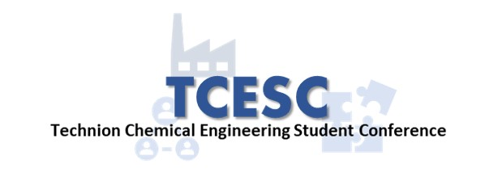
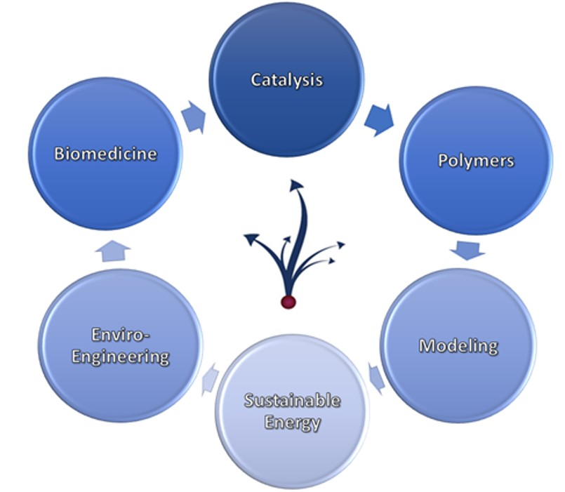
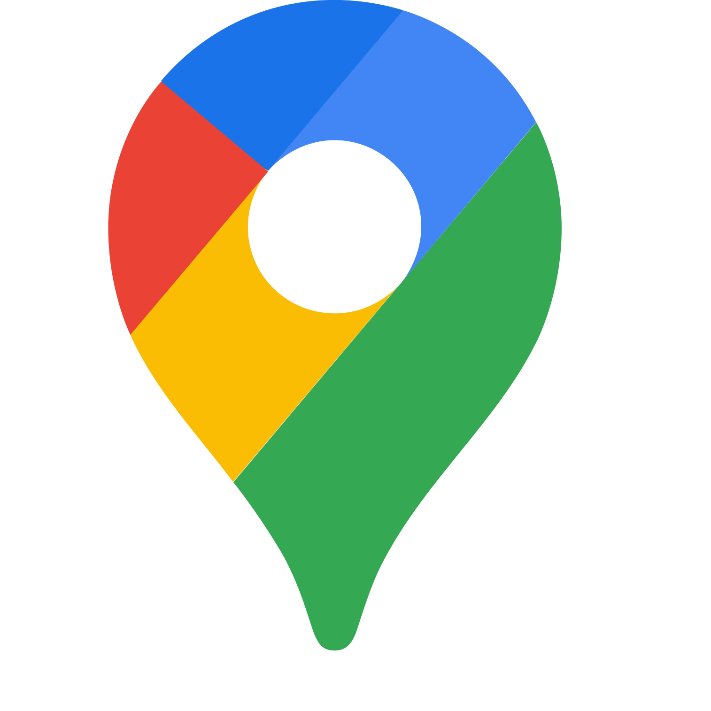
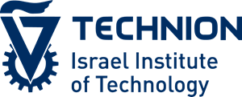
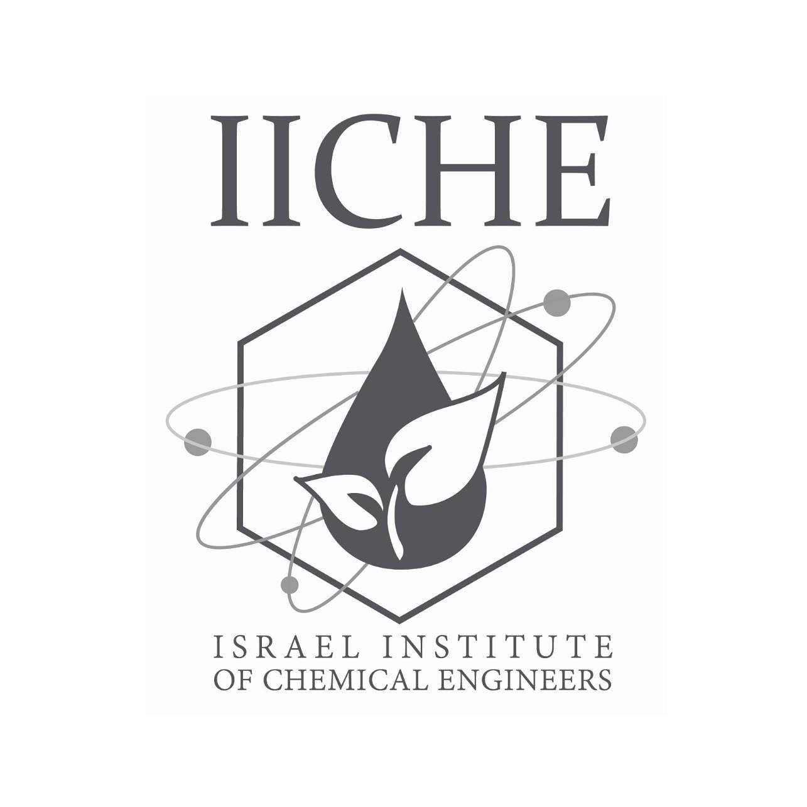
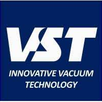
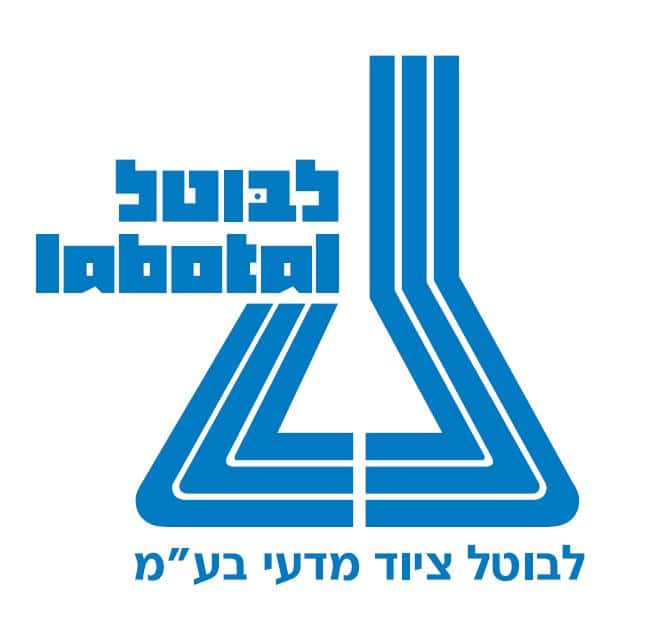

  

    

      
      
Home

    

  

  

    

      
      
Call for Participants

    

  

  

    

      
      
Program Schedule

    

  

  

    

      
      
Speakers

    

  

  

    

      
      
Registration

    

  

  

Welcome to the official website of TCESC! This conference is focused on a broad scope of research practiced in our department i.e. catalysis, energy, material science, polymers, drugs, modeling, microelectronics and sensors, and more.

 

## Event Information

- Date: 1-2/08/2023
- Location: Techion, Haifa, Israel. ) )
- Registration: Last few places remaining! sign up :<a href="https://ticks.co.il/e/1AkTbSul6m1"> here</a>

## Call for Papers

We are currently accepting papers from international speakers. If you are interested in presenting your work, please visit the [Call for Participants](./call-for-Participants.md) page for more information.

## Program Schedule

For a detailed program schedule visit the [program schedule](./program-schedule.md) page

## Contact Us

If you have any questions or comments, please do not hesitate to [contact us](mailto:tcesc@campus.technion.ac.il).

## About the Technion, Israel
<a href="https://www.technion.ac.il/en/home-2/">About the Technion</a>

## About the Wolfson Department of Chemical Engineering
<a href="https://chemeng.technion.ac.il/">About Chemical Engineering Department</a>

## Sponsers
Our conference was generously sponsored by:

* The Wolfson Department of Chemical Engineering: 

* The Technion, Israel Institute of Technology: 

* The Israel Institute of Chemical Engineers: 

* VST- Innovative Vacuum Technology: 

* Labotal: 

